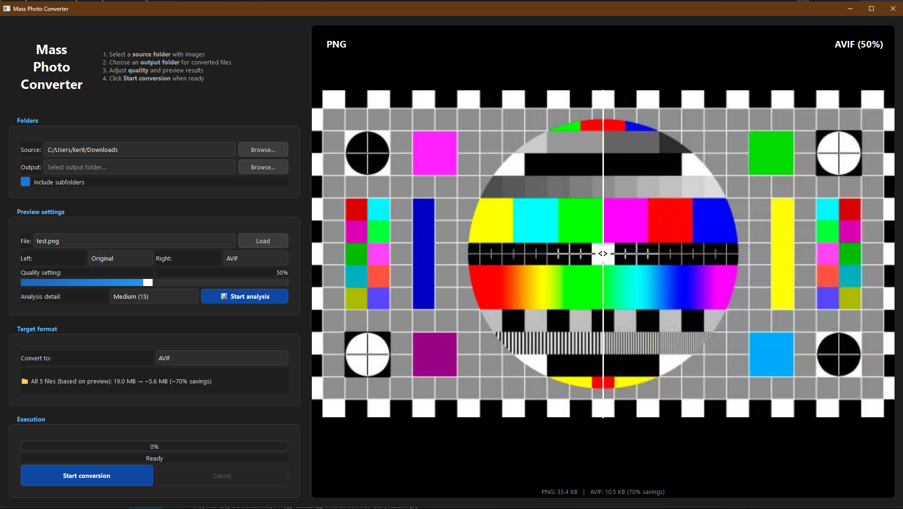
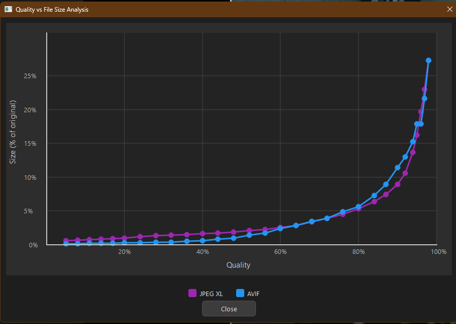

# Mass Photo Converter

**Mass Photo Converter** is a high-performance, multi-threaded batch image conversion tool designed to optimize images for modern web standards. It converts PNG, TIFF, and JPEG images into next-generation formats like AVIF and WebP, offering significant size reductions with minimal visual loss.

## Why I built this

I wanted to archive decades of family photos—scans of old prints, high-resolution camera exports, and everything in between—without them consuming hundreds of gigabytes of storage. Modern formats like AVIF can reduce file sizes by 60-80% while preserving the quality that matters for precious memories. This tool makes it easy to batch-convert entire photo libraries while giving you full control over the quality vs size tradeoff.

## Key features

- **🚀 High-performance batch processing**: Utilizes all available CPU cores to convert thousands of images in parallel.
- **👀 Interactive split-view preview**: Compare original vs converted images side-by-side in real-time.
  - **Draggable divider**: Inspect changes pixel-by-pixel.
  - **Zoom & pan**: Deep zoom support (scroll to zoom, right-drag to pan, double-click to reset).
- **📊 Quality vs size analysis**: Renders your image at multiple quality levels to plot a curve of file size vs quality. Helps find the perfect compression "sweet spot."
- **📂 Deep folder scanning**: Recursively scans source directories and replicates folder structure in output.
- **🎨 Modern dark theme**: Clean, professional UI with a 3-column split layout (controls on left, preview on right).

### Supported output formats

| Format   | Description                                   |
|----------|-----------------------------------------------|
| **AVIF** | Excellent compression, ideal for web use      |
| **WebP** | Widely supported, effective transparency      |
| **HEIC** | High compression (requires `pillow-heif`)     |
| **JPEG XL** | Next-gen JPEG (requires `pillow-jxl-plugin`) |



## Download

**Windows users**: Download the standalone `.exe` from the [Releases](https://github.com/Tokra110/Mass-Photo-Converter/releases) page—no installation required.

> [!NOTE]
> Windows SmartScreen may show a warning for unsigned executables. Click **"More info"** → **"Run anyway"** to proceed. The source code is fully open for review.

## Installation (from source)

1. **Clone the repository**:
   ```bash
   git clone https://github.com/Tokra110/Mass-Photo-Converter.git
   cd Mass-Photo-Converter
   ```

2. **Install dependencies** (Python 3.8+):
   ```bash
   pip install -r requirements.txt
   ```

## Usage

1. **Launch the application**:
   ```bash
   python main.py
   ```

2. **Select folders**:
   - Click **Browse** next to "Source" to select the folder containing your original images.
   - Click **Browse** next to "Output" to select where converted files should be saved.

3. **Preview & configure**:
   - Select an image from the dropdown and click **Load** to open it in the preview.
   - Adjust the **Quality slider** (5% - 100%) to see real-time changes.
   - Use the **Left/Right** dropdowns to compare different formats (e.g., Original vs AVIF).

4. **Analyze (optional)**:
   - Click **📊 Start analysis** to generate a chart showing how different quality settings affect file size.
   

5. **Convert**:
   - Select your target format from the "Target format" section.
   - Click **Start conversion**. A progress bar will track the batch process.
## Requirements

- **Operating System**: Windows, macOS, or Linux
- **Python**: 3.8 or higher
- **Libraries**:
  - `PyQt6`
  - `Pillow`
  - `pillow-heif` (optional, for HEIC support)
  - `pillow-jxl-plugin` (optional, for JPEG XL support)

## License

[MIT License](LICENSE)
